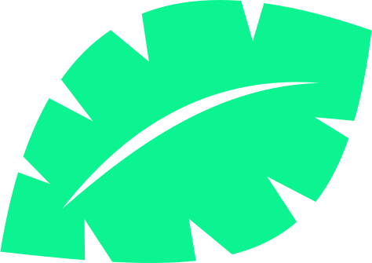

#  Greenhouse monitoring app.
_By Set HM 2023._

This mobile app shows the data that has been sent to ThingSpeak from the sensors installed in a Greenhouse.

> [!NOTE]
> Your Arduino/microcontroller code must send the sensors data to ThingSpeak.

The app monitors these sensors:

- RH sensor.
- Soil moisture sensor.
- Temperature sensor.
- Ambient light sensor.

##### Powered by

